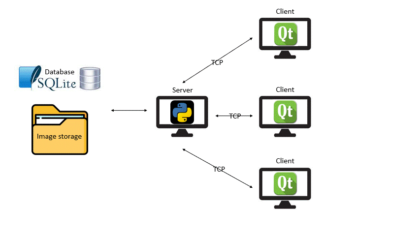
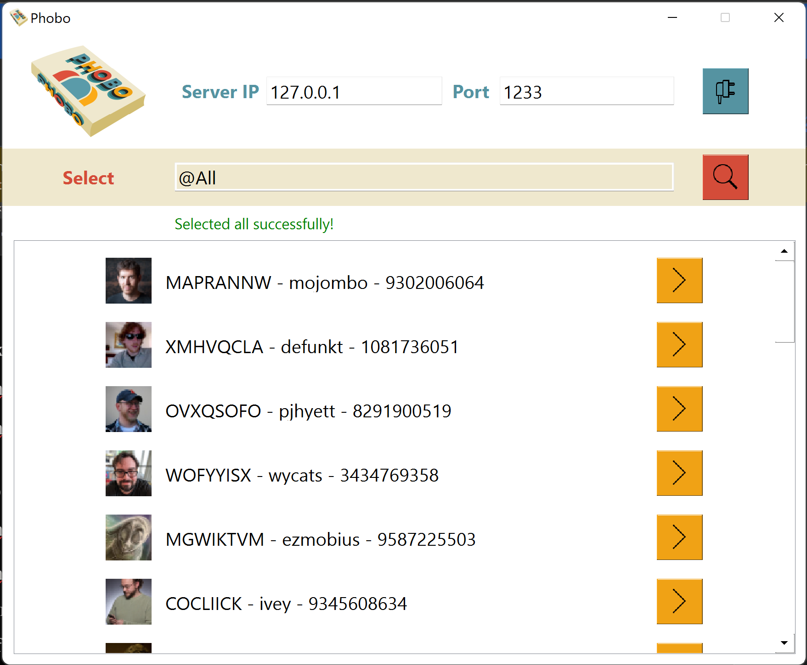

# Socket Python programming

Phone Book client-server application using Python [Socket][https://docs.python.org/3/library/socket.html], [SQLite][https://www.sqlite.org/docs.html] and [QT5][https://doc.qt.io/qt-5.15/]


## Prerequisite
** Install Python 3.9

** Install Pip

## Getting Started

**Step 1. Clone the code into a fresh folder**

```
$ git clone https://github.com/TranTienVan/phone-book-socket.git
```

**Step 2. Create a Virtual Environment and install Dependencies.**

Create a new Virtual Environment for the project and activate it. 

```
$ virtualenv venv
$ source venv/bin/activate
```

Next, we need to install the project dependencies, which are listed in `requirements.txt`.

```
(venv) $ pip install -r requirements.txt
```

**Step 3. Run the Client and Server app**

Server
```
(venv) $ python source/server/server.py
```

Client
```
(venv) $ python source/client/main.py
```



# Author
[Trần Tiến Văn][https://github.com/TranTienVan]
[Nguyễn Hoàng Khang][https://github.com/khangnh-22]
[Dương Lê Đình Thuận][https://github.com/ThuanDuongHCMUS]
